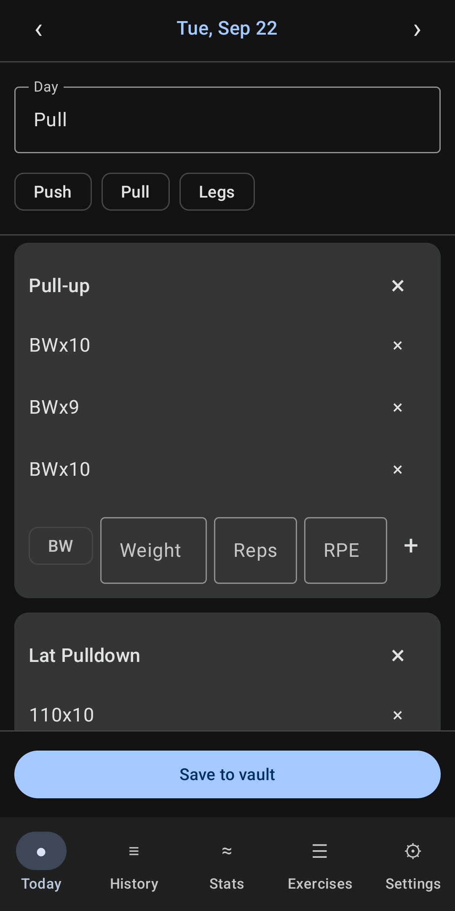
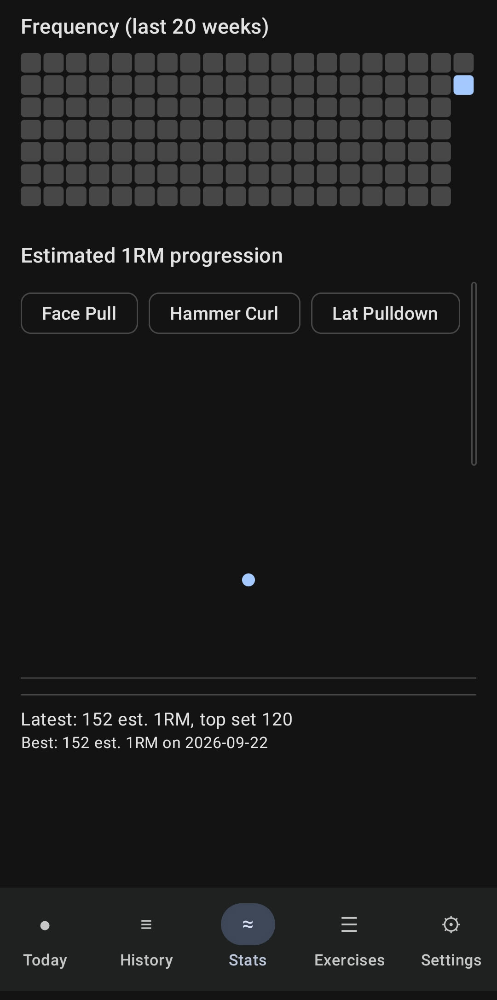

<p align="center">
  
</p>

<h1 align="center">Strong Vault</h1>

<p align="center">
  A fast, native Android workout tracker that reads and writes straight into your
  Obsidian-style daily notes vault - no separate database, no sync, no lock-in.
</p>

## Why

[androidhomecal](https://github.com/elijahlovold/android-obsidian-cal-widget), a companion widget, already opens your daily notes from the home
screen. Strong Vault extends the same idea to workouts: log sets during a lifting
session and they land directly in that day's note, in a plain-text format you can
read, grep, and hand-edit in `nvim` like everything else in the vault.

## How it works

- **Direct file access.** Like `androidhomecal`, Strong Vault reads and writes the
  vault directly via `MANAGE_EXTERNAL_STORAGE` ("All files access") - not through a
  content picker, not through Termux. You grant it once from the app's permission
  screen.
- **The vault is the source of truth.** The app never assumes it's the only thing
  touching your notes. Every save re-reads and re-parses the file immediately
  before writing, and refuses to overwrite anything it can't fully account for.
- **Format over database.** All workout data lives as plain text in your daily
  notes and in `Personal/Workout.md`. Delete the app and your history is still
  sitting right there in the vault.

## The format

### Daily note: `# Workout` section

The app adds a `# Workout` section to the end of each day's note, after any
existing sections like `# Agenda` and `# Scratchpad`:

```markdown
# Workout

**Day**: Push

## Bench Press
- 135x8
- 155x6
- 165x5@8

## Overhead Press
- 95x8
- 95x8
- 95x6@9 felt heavy

<!-- workout:end -->
```

- Each set is `<load>x<reps>[@rpe][ note]`.
  - `load` is a plain number, `BW` (bodyweight), `BW+25` (weighted), or `BW-15`
    (assisted).
  - `@8` is optional RPE.
  - Anything after that is a free-text note.
- **`<!-- workout:end -->` is required.** If it's missing - because a section got
  cut off, half-edited, or corrupted some other way - the app treats that day as
  **unparseable** and refuses to touch it. It'll show you the raw text instead of
  guessing, so a malformed section can never be silently overwritten or have data
  disappear from underneath it.
- Anything else written inside the section (a stray note, an extra line) is
  preserved exactly as-is when the app saves, even though it isn't part of the
  structured format.
- Logging a workout also adds `workout` to the note's frontmatter `tags:` list, if
  it isn't already there. This is additive only - the app never removes a tag.

### `Personal/Workout.md`: exercises and day templates

```markdown
---
type: workout-config
---

# Exercises

- Bench Press
- Squat
- ...

# Templates

## Push
- Bench Press
- Overhead Press
- ...
```

This is the master exercise list and the Push/Pull/Legs-style templates the app
offers as quick-start chips on the Today screen. A starter file with a full
Push/Pull/Legs split is included at [`Personal/Workout.md`](Personal/Workout.md) -
copy it into your vault. If the file is missing or unreadable, the app falls back
to a small built-in default list rather than blocking you from logging a workout.

## Screens

- **Today** - log sets for any date (defaults to today), with template quick-start
  chips and fast numeric entry for weight/reps/RPE.
- **History** - browse recent logged days, tap through to edit any of them.
- **Stats** - a frequency heatmap and an estimated-1RM progression chart per
  exercise, drawn with plain Compose `Canvas` (no charting library).
- **Exercises** - view the master list and templates from `Workout.md`.
- **Settings** - vault path and weight unit (label only; the file format itself
  doesn't record a unit, so keep it consistent once you start logging).

<p align="center">
  
  &nbsp;&nbsp;
  
</p>

## Build

```sh
./gradlew assembleDebug
```

Output APK: `app/build/outputs/apk/debug/app-debug.apk`

```sh
adb install app/build/outputs/apk/debug/app-debug.apk
```

Run the unit tests (parser, writer, and frontmatter-tag logic are the
safety-critical pieces, so they're the most heavily covered):

```sh
./gradlew testDebugUnitTest
```

## Setup

1. Install the app and grant **All files access** when prompted.
2. In Settings, confirm the vault path (defaults to the same
   `/storage/emulated/0/Documents/Vault` that `androidhomecal` uses) and your
   preferred weight unit.
3. Copy [`Personal/Workout.md`](Personal/Workout.md) into your vault, or edit it
   to match your own exercises and split.
4. Log a workout from the Today tab - if today's daily note doesn't exist yet, the
   app creates a minimal one for you.

## Design notes

- No adaptive-icon foreground/background dependency on external libraries or
  vector art generators - `images/app_icon.png` is the single source image, scaled
  and safe-zoned into the launcher icon assets under `app/src/main/res/mipmap-*`.
- Bootup only ever touches today's note. History and Stats scan a bounded window
  of recent days in the background, so performance doesn't degrade as the vault
  grows.
